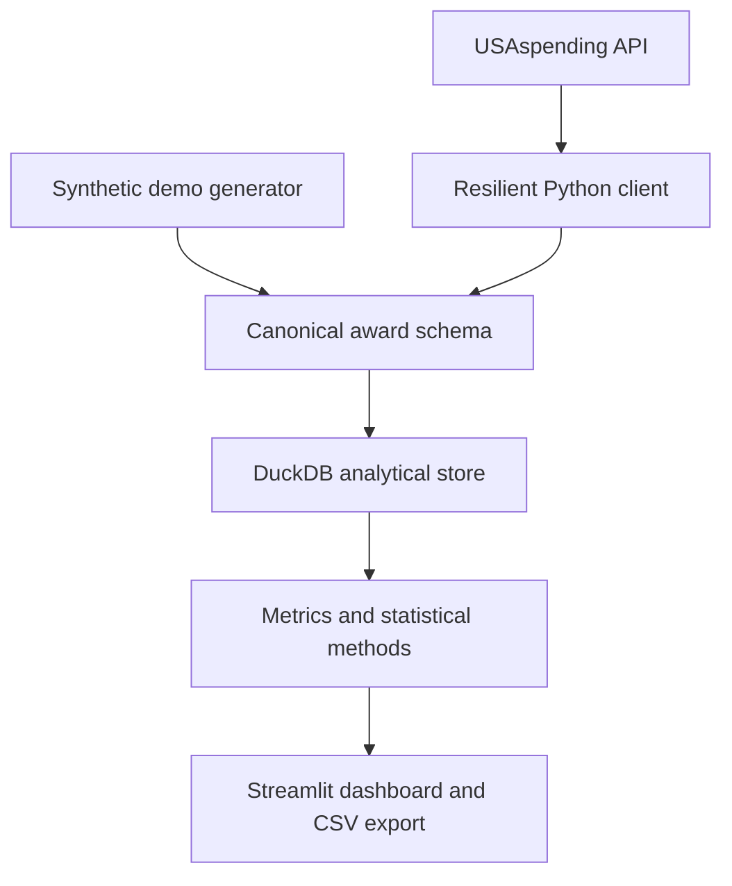

# AwardLens

[](https://github.com/mgajadar/awardlens/actions/workflows/ci.yml)
[](https://www.python.org/)
[](LICENSE)

**AwardLens is an end-to-end federal procurement analytics platform for exploring award
trends, vendor concentration, unusual contract values, and short-term spending patterns.**

It turns public USAspending data into a reproducible local analytical product: resilient API
ingestion, a canonical data model, DuckDB storage, transparent statistical methods, an
interactive dashboard, automated tests, Docker packaging, and continuous integration.

> AwardLens is an independent portfolio project. It is not affiliated with or endorsed by the
> U.S. government. An anomaly flag means "review this record," not fraud, waste, or wrongdoing.

## Why this project exists

Federal procurement data is public but analytically awkward: users must understand award-type
filters, paginate a remote API, normalize inconsistent fields, preserve lineage, and avoid
overstating what descriptive patterns prove. AwardLens packages that work into a small system
that an analyst can run, inspect, test, and extend.

## Product capabilities

- Fetches prime contract awards from the public USAspending API
- Retries transient API failures and caps pagination for safe development
- Normalizes external fields into a documented internal schema
- Upserts records into an embedded DuckDB analytical database
- Measures monthly award value and agency composition
- Calculates vendor spend shares and the Herfindahl-Hirschman Index (HHI)
- Screens unusually large awards with robust median-absolute-deviation scores
- Produces an interpretable trend-and-seasonality forecasting baseline
- Supports interactive filtering and CSV export in Streamlit
- Runs fully offline with a deterministic synthetic demonstration dataset
- Ships with unit/integration tests, Ruff linting, GitHub Actions, and Docker

## Architecture



The external API is kept behind a client boundary, business calculations are pure functions,
and the dashboard reads only the canonical model. That separation makes each layer independently
testable and allows another warehouse or front end to replace DuckDB or Streamlit later.

## Quick start

### Using `uv`

```bash
git clone https://github.com/mgajadar/awardlens.git
cd awardlens
uv sync --extra dev
uv run awardlens demo
uv run streamlit run app.py
```

Open <http://localhost:8501>. If the database is empty, the dashboard automatically loads the
synthetic demo so a reviewer never sees a broken first run.

### Using standard Python

```bash
python -m venv .venv
source .venv/bin/activate  # Windows: .venv\Scripts\activate
python -m pip install -e ".[dev]"
awardlens demo
streamlit run app.py
```

### Using Docker

```bash
docker compose up --build
```

## Load live public data

USAspending does not require an API key for this endpoint:

```bash
awardlens ingest \
  --start 2025-01-01 \
  --end 2025-12-31 \
  --agency "Department of Defense" \
  --max-pages 10
```

The `--max-pages` option is an intentional safety boundary. Increase it only after considering
request volume, response stability, and whether an asynchronous bulk download is more suitable.

Other CLI workflows:

```bash
awardlens summary
awardlens export data/awardlens_export.csv
```

Configuration can be supplied through environment variables documented in `.env.example`.

## Analytical methods

### Vendor concentration

AwardLens reports each vendor's share of total awarded value and HHI:

$$HHI = 10{,}000 \sum_i s_i^2$$

where $s_i$ is vendor $i$'s share expressed from 0 to 1. HHI is a concentration indicator,
not a determination that competition was inadequate.

### Anomaly screening

Award values are log-transformed and compared inside awarding-agency/NAICS segments. The robust
score is based on the median absolute deviation (MAD):

$$score_i = 0.6745\frac{x_i - \operatorname{median}(x)}{MAD(x)}$$

Small segments fall back to the global distribution. This design is explainable and resistant to
outliers, but it does not control for contract scope, quantity, urgency, or performance terms.

### Forecast baseline

Monthly awarded value is modeled with ordinary least squares using an intercept, linear trend,
and annual sine/cosine terms. The result is intentionally a transparent baseline—not a budgeting
forecast or causal model. The dashboard displays an approximate 80% residual interval.

## Repository structure

```text
awardlens/
├── app.py                         # Streamlit Cloud entry point
├── src/awardlens/
│   ├── analytics.py               # Metrics, HHI, anomalies, forecast
│   ├── cli.py                     # Reproducible command-line workflows
│   ├── config.py                  # Environment-based settings
│   ├── database.py                # DuckDB persistence boundary
│   ├── dashboard.py               # Interactive analytical product
│   ├── demo_data.py               # Deterministic offline dataset
│   ├── pipeline.py                # End-to-end orchestration
│   ├── schema.py                  # Canonical column contract
│   └── usaspending.py             # Public API integration
├── tests/                         # Unit and integration coverage
├── docs/                          # Architecture, owner, and interview guides
├── Dockerfile
├── compose.yaml
└── pyproject.toml
```

## Quality checks

```bash
ruff check .
pytest --cov=awardlens --cov-report=term-missing
```

CI executes the same checks on every pull request and push to `main`.

## Responsible interpretation and limitations

- USAspending award values are not unit prices and do not establish price reasonableness.
- Public records can be revised, delayed, incomplete, or returned with null classifications.
- Award-level totals and transaction-level obligations answer different questions.
- Vendor concentration can be mission-appropriate and is not evidence of misconduct.
- Statistical anomalies are leads for contextual review, never conclusions.
- The included forecast is a portfolio demonstration baseline and is not decision guidance.
- The offline dataset is synthetic and clearly labeled throughout the product.

## Documentation

- [Architecture and design decisions](docs/ARCHITECTURE.md)
- [Canonical data dictionary](docs/DATA_DICTIONARY.md)
- [Owner's guide](docs/OWNER_GUIDE.md)
- [Interview defense pack](docs/INTERVIEW_GUIDE.md)

## Roadmap

- Add transaction-level modification analysis
- Persist ingestion-run metadata and data-quality results
- Add NAICS/PSC reference enrichment
- Benchmark multiple forecasting approaches with rolling-origin validation
- Deploy the dashboard with scheduled data refreshes

## Author

**Marcus Gajadar** — data analytics and applied AI engineering
